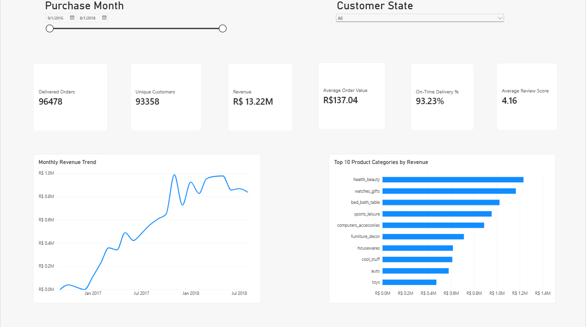
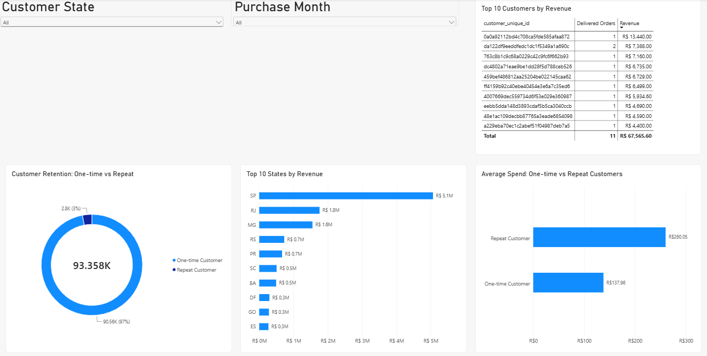
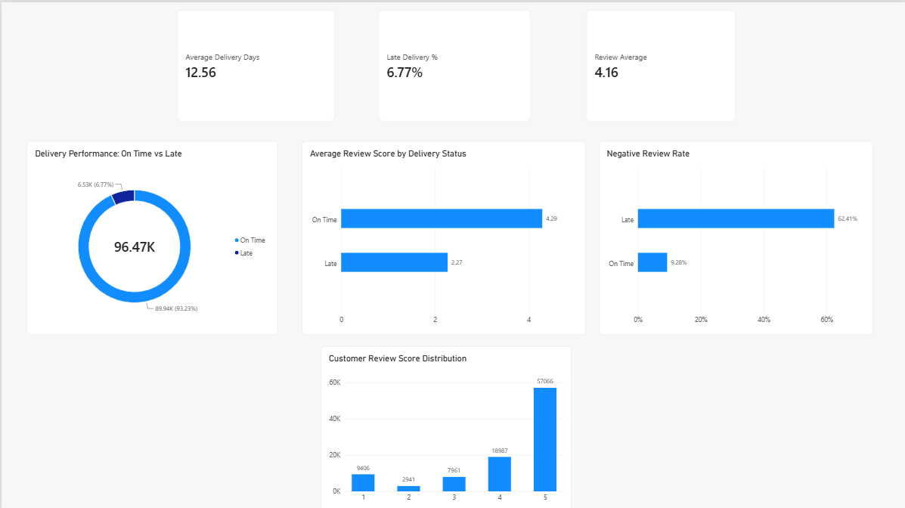

# Olist E-Commerce Sales & Customer Analytics

This project combines MySQL, Python exploratory analysis, and a three-page Power BI dashboard to study sales, customers, delivery performance, and customer satisfaction in the Brazilian Olist e-commerce dataset.

## Tools and deliverables

- **MySQL 8.0+:** data-quality checks, documented cleaning, and sales, customer, seller, delivery, and satisfaction queries.
- **Python:** a Jupyter/Colab notebook using pandas, NumPy, and Matplotlib, with analysis and CSV export steps.
- **Power BI:** an embedded-data report with Executive Overview, Customer & Sales Analysis, and Delivery & Satisfaction pages.
- **Documentation:** business definitions, findings, dashboard previews, and data/setup instructions.

Source CSVs and processed exports are not bundled; see [data instructions](data/README.md).

## Dataset

Brazilian E-Commerce Public Dataset by Olist. The table names below are the names used in the imported MySQL database.

| Table | Validated rows | What it contains |
|---|---:|---|
| customers | 99,441 | Customer records and location |
| orders | 99,441 | Order status and timestamps |
| order_items | 112,650 | Products, sellers, prices and freight per order item |
| order_payments | 103,886 | Payment methods, installments and payment values |
| order_reviews | 99,224 | Review scores, comments and timestamps |
| products | 32,951 | Product categories, dimensions and other details |
| sellers | 3,095 | Seller records and location |
| geolocation | 1,000,163 | Coordinates associated with ZIP prefixes |
| category_translation | 71 | Portuguese-to-English category names |

All-order purchase dates run from 4 September 2016 to 17 October 2018. Delivered-order purchase dates run from 15 September 2016 to 29 August 2018. The earliest and latest periods have limited coverage, so they should not be treated as normal full periods.

### How the tables connect

- customers.customer_id → orders.customer_id
- orders.order_id → order_items, order_payments and order_reviews
- products.product_id → order_items.product_id
- sellers.seller_id → order_items.seller_id
- products.product_category_name → category_translation.product_category_name

Use `customer_unique_id` to identify the same customer across orders. `customer_id` identifies the customer record associated with an order.

An order can have multiple items, payments and reviews. Joining these tables directly can multiply rows. Geolocation also has repeated ZIP prefixes; prepare one appropriate location per prefix before using it in joins. It is not used in the current business queries.

## Data cleaning and validation

### 1. Review CSV import: 99,223 vs 99,224

The first review import returned 99,223 rows instead of 99,224, with a truncation warning. Investigation identified a parsing issue in `review_comment_message`: one comment ended with a backslash immediately before the closing CSV quote, which conflicted with MySQL `LOAD DATA` escape handling.

The affected `review_id` was `636b237e87574ba29654deaba9eb9797`, linked to `order_id` `d7361a834a2dd8db2f6f133ce291ab6b`.

The problematic source record was corrected, the review dataset was re-imported, and the final `order_reviews` table was validated at 99,224 rows.

### 2. Product missing values and source-recorded zero weights

Initial `IS NULL` checks missed several import artifacts. Blank values imported into MySQL were converted to `NULL` where appropriate.

Python cross-validation against the source CSV then showed that `product_weight_g` contains **2 missing values and 4 source-recorded zero values**. The four source-recorded zeros were preserved/restored in MySQL rather than being treated as missing. Their presence in the source does not establish that the products physically weigh zero.

| Product field | Missing values after final cleaning |
|---|---:|
| Category | 610 |
| Name length | 610 |
| Description length | 610 |
| Photo count | 610 |
| Weight | 2 |
| Length | 2 |
| Height | 2 |
| Width | 2 |

Final weight validation:

- Missing product weights: **2**
- Source-recorded zero product weights: **4**

The SQL keeps the source column spellings `product_name_lenght` and `product_description_lenght`. These transformations document this imported dataset; they are not a general rule that every zero in every dataset means missing.

### 3. Missing order dates imported as zero dates

Missing dates had been stored as `0000-00-00 00:00:00`. The confirmed approval, carrier and customer-delivery zero dates were converted to `NULL`.

| Field | Missing values after cleaning |
|---|---:|
| order_approved_at | 160 |
| order_delivered_carrier_date | 1,783 |
| order_delivered_customer_date | 2,965 |
| order_estimated_delivery_date | 0 |

Missing dates were kept missing. No dates were invented.

### 4. Carrier dates before purchase

166 orders (about 0.17%) had a carrier date before the purchase timestamp. The orders and original timestamps were retained.

Exclude these records from purchase-to-carrier duration calculations by requiring both timestamps and `carrier date >= purchase date`. They remain available for valid sales and customer analysis. Purchase-to-customer delivery time uses its own date-validity filter.

### 5. Other checks

- No duplicates were found in `customer_id`, `order_id` in orders, `product_id`, `seller_id` or the order-item composite key.
- All six main relationship checks returned zero orphan records.
- No nonpositive item prices, negative freight/payments/installments, out-of-range review scores, purchase-after-estimate dates or customer-delivery-before-purchase dates were found by the recorded checks.
- Two zero-installment payment records and three `not_defined` payment records were retained.
- 87,656 review titles and 58,247 review messages were missing. Reviews with a valid score were retained.
- Repeated review IDs were not blindly removed. A repeated identifier is not automatically a duplicate record.
- The maximum observed delivery duration, 209.63 days, was retained and should be shown carefully in distribution charts.

## Business definitions

- Revenue = `SUM(order_items.price)` for delivered orders only.
- Freight = `SUM(order_items.freight_value)`, reported separately.
- Total order value = product revenue + freight.
- Average order value = delivered product revenue / distinct delivered orders with items.
- Products sold = order-item rows.
- Unique customers = distinct `customer_unique_id`.
- Repeat customers = customers with at least two delivered orders within this dataset.
- Positive reviews = 4–5 stars. Negative reviews = 1–2 stars.
- On time = `DATE(actual customer delivery) <= DATE(estimated delivery)`. Late = actual calendar date > estimated calendar date. Only delivered orders with both dates are classified.
- Delivery duration = `TIMESTAMPDIFF(SECOND, purchase, customer delivery) / 86400`, with nonmissing timestamps and delivery >= purchase.
- Category satisfaction first deduplicates `order_id + category`, then joins review rows. `total_reviews`, average rating, positive percentage and negative percentage are calculated from the resulting review rows.
- Combined category revenue and satisfaction aggregates sales and review metrics separately before joining the category summaries. Categories shown in the satisfaction analysis must have at least 100 review rows. Revenue for each category includes all delivered item sales, including orders without reviews.
- Monthly revenue uses purchase month for orders whose final status is delivered.
- Payment value is a separate payment measure; it is not used as product revenue.

## Key findings

### Sales

| KPI | Result |
|---|---:|
| Delivered orders | 96,478 |
| Products sold | 110,197 |
| Product revenue | R$13,221,498.11 |
| Freight | R$2,198,275.64 |
| Total order value | R$15,419,773.75 |
| Average order value | R$137.04 |
| Unique customers | 93,358 |

The executive customer KPI uses `COUNT(DISTINCT customer_unique_id)`: 93,358 unique customers. The 96,478 delivered orders and 96,478 associated `customer_id` records are separate measures.

November 2017 was the highest-revenue month, at about R$987,765 from 7,289 delivered orders. Four of the five highest-revenue months were in 2018.

| Top category | Product revenue | Revenue share |
|---|---:|---:|
| Health & Beauty | R$1,233,131.72 | 9.33% |
| Watches & Gifts | R$1,166,176.98 | 8.82% |
| Bed, Bath & Table | R$1,023,434.76 | 7.74% |
| Sports & Leisure | R$954,852.55 | 7.22% |
| Computers & Accessories | R$888,724.61 | 6.72% |

These category revenues come from the sales analysis without review joins.

High volume did not always mean high revenue. The top product by units sold was a Furniture Decor item with 520 units and R$37,104.30 revenue. The top product by revenue was a Health & Beauty item with 194 units and R$63,560 revenue.

Credit cards accounted for 78.46% of delivered-order payment value, with an average of 3.50 installments per credit-card payment record.

### Customers

São Paulo generated R$5,067,633.16, or 38.33% of product revenue. SP, RJ and MG together accounted for about 63.4%.

| Customer type | Customers | Share of customers | Average spend | Revenue share |
|---|---:|---:|---:|---:|
| One-time | 90,557 | 97.00% | R$137.96 | 94.49% |
| Repeat | 2,801 | 3.00% | R$260.05 | 5.51% |

Repeat customers spent about 88% more per customer within the observed period. This supports exploring retention opportunities, but it is not a permanent company-wide retention rate or proof that a retention campaign will cause higher spending.

Average spending across unique customers was R$141.62. The highest-value customer spent R$13,440 in one delivered order containing eight items.

### Sellers and delivery

The top seller, based in Guariba, SP, generated R$226,987.93 from 1,124 delivered orders. Most top-ten sellers were based in SP.

| Delivery KPI | Result |
|---|---:|
| Orders with valid delivery duration | 96,470 |
| Average delivery time | 12.56 days |
| Fastest delivery | 0.53 days |
| Slowest delivery | 209.63 days |
| On-time delivery | 93.23% |
| Late delivery | 6.77% |

On-time and late rates use the 96,470 delivered orders with known actual and estimated delivery dates: 89,936 on time and 6,534 late. The eight delivered orders without an actual delivery timestamp are unclassified.

### Customer satisfaction

Delivered orders had 96,361 review rows, an average score of 4.16/5, 78.93% positive reviews and 12.81% negative reviews. Five-star reviews represented 59.22%.

| Delivery status | Review rows | Average rating | Positive | Negative |
|---|---:|---:|---:|---:|
| On Time | 89,944 | 4.29 | 82.64% | 9.28% |
| Late | 6,409 | 2.27 | 26.71% | 62.41% |

Late delivery was associated with much lower ratings. Its negative-review rate was about 6.7 times the on-time rate. This is an association, not proof of causation. Review-row counts differ from order counts because review coverage and multiplicity differ.

The corrected category satisfaction query gives the following validated ratings among categories with at least 100 review rows:

| Category | Average rating |
|---|---:|
| Books - General Interest | 4.53 |
| Food & Drink | 4.45 |
| Books - Technical | 4.43 |
| Luggage Accessories | 4.37 |
| Health & Beauty | 4.23 |
| Sports & Leisure | 4.23 |
| Garden Tools | 4.18 |

The corrected combined analysis reports Bed, Bath & Table at R$1,023,434.76 revenue, **9,295 review rows**, a 4.00 average rating and 16.09% negative reviews.

Office Furniture has R$268,154.31 revenue, **1,249 review rows**, a 3.64 average rating and 22.02% negative reviews.

These results use one `order_id + category` combination before joining reviews, which prevents order items from multiplying review rows.

Reviews describe whole orders rather than individual products. An order containing multiple product categories contributes its review rows once to each distinct category represented in that order. Therefore, category review counts are not additive across categories.

The delivery comparison covers 96,353 review rows with both delivery dates; overall satisfaction covers 96,361 delivered-order review rows. Review-row counts differ from order counts because review coverage and multiplicity differ. Delivery duration covers 96,470 orders with valid purchase-to-delivery timestamps; the delivery-status query independently requires actual and estimated delivery dates.

## Business recommendations

- Investigate delivery delays, especially orders with very poor review scores.
- Explore repeat-purchase campaigns and measure their results.
- Prioritize investigating Bed, Bath & Table, Computers & Accessories and Furniture Decor because they combine substantial sales with comparatively weaker satisfaction in the corrected analysis.
- Review Office Furniture separately because of its low reported rating.
- Retain separate sales and review aggregates and order-category deduplication when extending the dashboard.

## Dashboard previews

### Executive Overview



### Customer & Sales Analysis



### Delivery & Satisfaction



## Folder structure

```text
olist-ecommerce-analytics/
├── sql/
│   ├── 01_data_quality.sql
│   ├── 02_sales_analysis.sql
│   ├── 03_customer_analysis.sql
│   ├── 04_seller_delivery_analysis.sql
│   └── 05_customer_satisfaction.sql
├── python/
│   └── olist_eda.ipynb
├── powerbi/
│   └── Olist_Ecommerce_Analytics_Dashboard.pbix
├── images/
│   ├── executive_overview.png
│   ├── customer_sales_analysis.png
│   └── delivery_satisfaction.png
├── data/
│   └── README.md
├── requirements.txt
├── .gitignore
└── README.md
```

## Reproduce the analysis

### Data and MySQL

1. Obtain the Brazilian E-Commerce Public Dataset by Olist and follow [data/README.md](data/README.md).
2. Use MySQL 8.0+ for common table expressions and window functions. Import CSVs into the table names documented above, preserving IDs as text and using appropriate numeric and nullable timestamp types. Database schema/import scripts are not included.
3. Select your database, then run `sql/01_data_quality.sql` section by section. Inspect the checks before executing cleaning updates. The updates document specific import artifacts; an already-cleaned import may not need them.
4. Run the four analysis files in numbered order, treating each section as an independent query. Compare the results with the documented definitions and KPIs.

### Python

1. Open `python/olist_eda.ipynb` in Google Colab. The notebook uses pandas, NumPy, and Matplotlib; dependencies are listed in `requirements.txt`.
2. Place the eight input CSVs in your chosen Google Drive folder. Mount Google Drive and edit `base_path` and `processed_path` to match your folders. Keep a trailing `/` in both paths because the notebook appends filenames to them.
3. Restart the session and run all cells in order. The notebook creates the folder specified by `processed_path` before exporting CSV files.
4. The analysis uses delivered-order reviews for the review-distribution chart and review-row counts after deduplicating `order_id + category` pairs.
5. Product-weight handling preserves the four source-recorded zero values and leaves the two missing values as missing. Source-recorded zeros are not proof that the products physically weigh zero.
6. Save and download the executed notebook so the repository includes its latest outputs.

### Power BI

Open `powerbi/Olist_Ecommerce_Analytics_Dashboard.pbix` in Power BI Desktop. The report contains an embedded data model. To refresh, generate the notebook exports, then use Power Query/data-source settings to point each file-based source to the folder containing the CSVs exported through `processed_path`. If the notebook ran in Colab, download those exports to your computer before configuring Power BI Desktop.

Review averages and percentages should use review rows, while customer counts should use distinct `customer_unique_id`.

The on-time delivery KPI uses:

- On-time orders: 89,936
- Late orders: 6,534
- Classified delivered orders: 96,470
- On-time rate: 93.23%

## Limitations

- Source data, processed CSVs, database schema/import scripts, and the historical review-CSV repair script are not included.
- Findings describe the observed dataset and delivered-order population; retention and delivery associations are not causal estimates.
- Category review counts are based on review rows after deduplicating `order_id + category`. They are not additive across categories because one reviewed order can contain products from multiple categories.
- Dependency versions are unpinned because the original environment did not record them; a fresh installation may use newer library versions.
